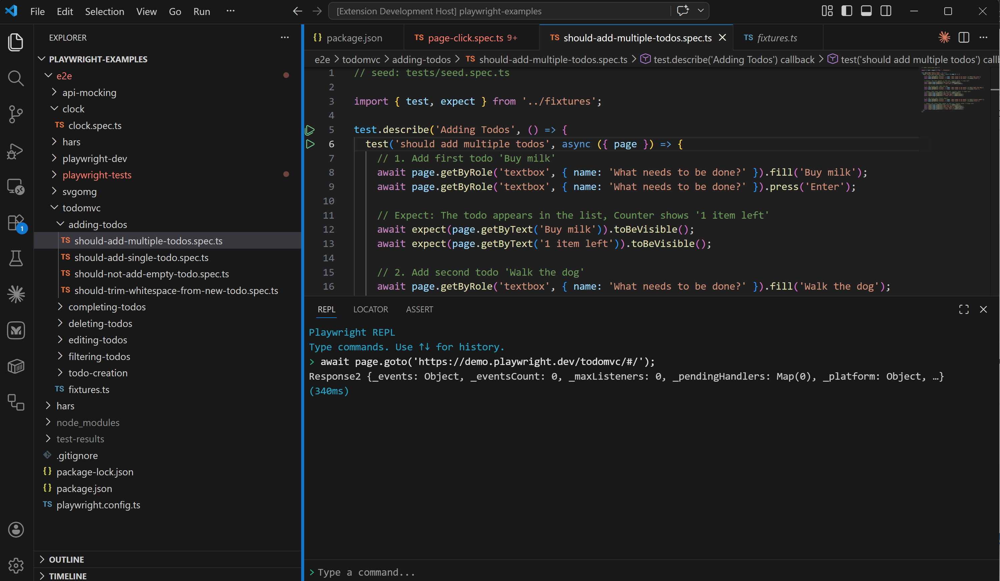
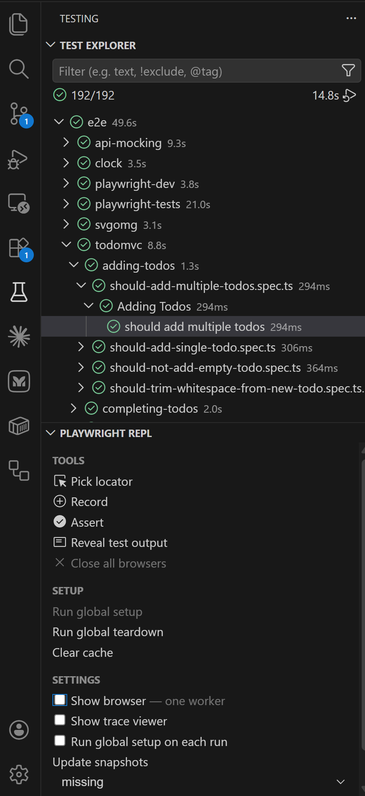
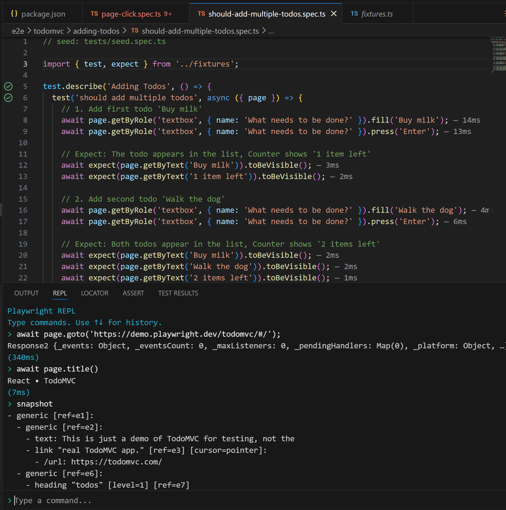
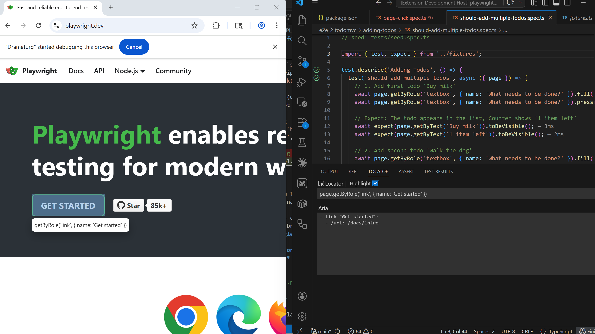
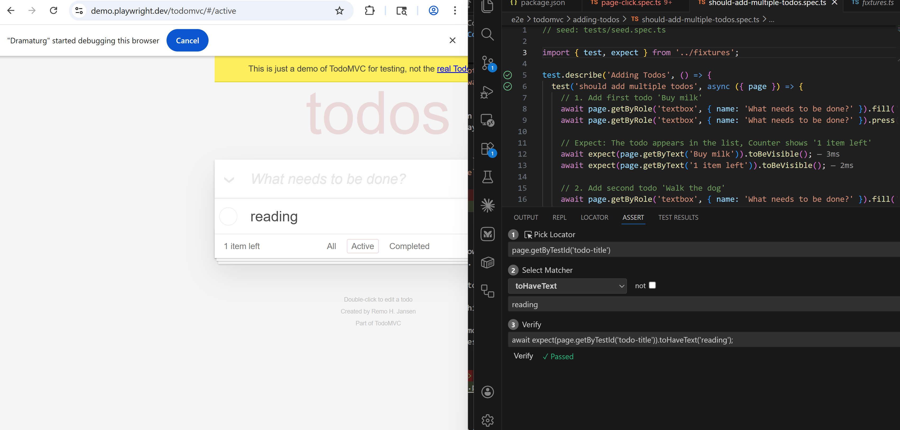

# Playwright REPL for VS Code

Interactive browser automation inside VS Code — Test Explorer, live REPL, assertion builder, and element picker.



## Features

### Test Explorer

Run Playwright tests with a persistent browser and context reuse. Works with individual tests and files. Folders fall back to the standard multi-worker path.



### REPL Panel

Interactive command panel in the bottom bar. Type keyword commands (`snapshot`, `click`, `fill`, `goto`) or JavaScript (`await page.title()`, `page.locator('h1').click()`).

- Command history (up/down arrows)
- Inline screenshot display
- PDF save
- Execution timing
- Local commands: `help`, `.aliases`, `.status`, `.history`, `locator`, `page`



### Locator Panel

Pick elements from the browser and inspect their locator and ARIA snapshot.

- **Pick arrow** — click to enter pick mode, click an element in the browser
- **Highlight toggle** — highlight the picked element
- **Editable locator** — modify and experiment
- **ARIA snapshot** — accessibility tree for the picked element



### Assert Builder

Build and verify Playwright assertions interactively:

1. **Pick Locator** — pick an element or type a locator manually
2. **Select Matcher** — 13 matchers, smart-filtered by element type
3. **Verify** — run the assertion against the live page, see pass/fail instantly

Matchers: `toContainText`, `toHaveText`, `toBeVisible`, `toBeHidden`, `toBeAttached`, `toBeEnabled`, `toBeDisabled`, `toBeChecked`, `toHaveValue`, `toHaveAttribute`, `toHaveCount`, `toHaveURL`, `toHaveTitle`

Supports negation (`not` checkbox) and editable assertions.



### Recorder

Record browser interactions as Playwright commands. Click elements, fill forms, navigate — the recorder captures each action as `.pw` keyword commands or Playwright JavaScript.

### Browser Reuse

REPL, Test Explorer, Recorder, and Picker all share the same headed browser. No extra browser windows. The browser stays open between test runs — no context setup overhead per test.

## Workflow

**Record → Pick Locator → Assert → Run Test**

1. **Record** interactions to generate test steps
2. **Pick** elements to get locators
3. **Assert** expected values against the live page
4. **Run** tests through the Test Explorer

## Commands

| Command | Description |
|---------|-------------|
| `Playwright REPL: Launch Browser` | Launch Chromium with extension |
| `Playwright REPL: Stop Browser` | Close browser |
| `Playwright REPL: Open REPL` | Open the REPL panel |
| `Playwright REPL: Pick Locator` | Enter pick mode |
| `Playwright REPL: Start Recording` | Start recording actions |
| `Playwright REPL: Stop Recording` | Stop recording |
| `Playwright REPL: Assert Builder` | Open Assert Builder and start pick |

## Getting Started

1. Install the extension
2. Open a project with a `playwright.config.ts`
3. Click **Launch Browser** or run a test (browser auto-launches if Show Browser is enabled)
4. Use the **REPL**, **Locator**, and **Assert** panels in the bottom bar

## Requirements

- VS Code 1.86+
- Node.js 18+
- `@playwright/test` 1.59+ in your project

## Panels

The extension adds three panels to the bottom bar:

| Panel | Purpose |
|-------|---------|
| **REPL** | Interactive command execution |
| **Locator** | Element inspection and highlight |
| **Assert** | Assertion building and verification |

## Development

```bash
cd packages/vscode
pnpm run build

# Watch mode
node build.mjs --watch

# Run (F5 in VS Code with the repo open)
```

## License

Apache 2.0
